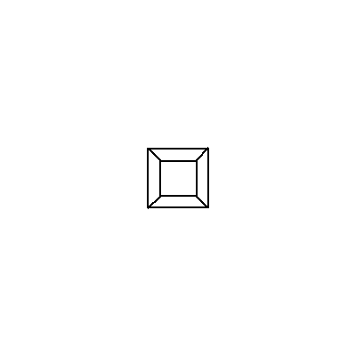
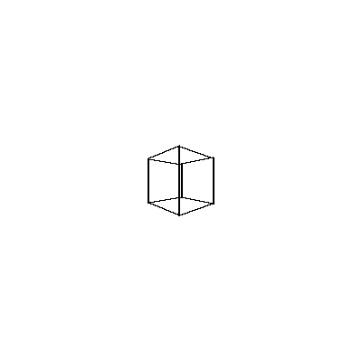
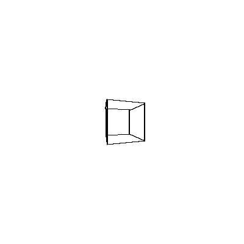
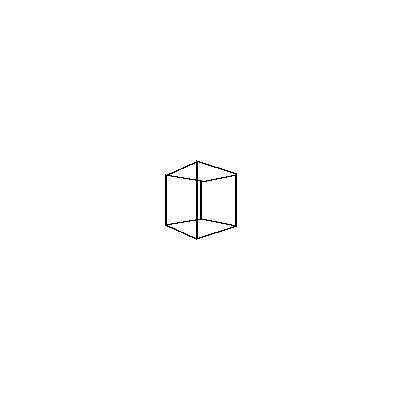

## 3D-Rendering-Engine

The purpose of this 3D rendering engine is to create, transform and project a 3D object (a cube) onto a 2D plane (screen), animating it (with multiple frames) through rotation. The key steps include defining the 3D structure, applying transformations (rotation and translation), projecting the transformed 3D points onto a 2D plane, and rendering the results.

## Video Demonstration

Here are some example frames:

